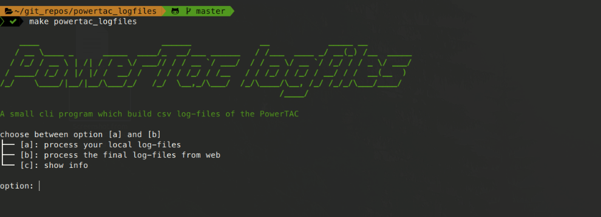

A small cli program which build csv log-files of the PowerTAC

### Provide:

- Process powertac custom logfiles or from powertac website
- Create logfiles as csv-files using powertac logtool


### Requirements:

- Python 3.6
- Make
- powertac-tools
- Maven 3.3.x or higher


### Installation:

```
git clone https://github.com/nreinhol/powertac_logfiles.git
cd powertac_logfiles
git clone https://github.com/powertac/powertac-tools.git
make requirements
make data_dir
cd powertac-tools/logtool-examples
mvn clean install
```

### Run:
go to the powertac_logfiles directory and run:
```
make powertac_logfiles
```



### Options:

**[a]**: processing your own custom PowerTAC state/trace file into csv-file

- just put your files into data/local  

**[b]**: processing the final games of PowerTAC from web  

- download tar-files from official PowerTAC website (http://ts.powertac.org/log/)
- extract state/trace files from tar-file
- create log-files as csv-file
- info: download url can be adjusted in init of data package

**[c]**: show a small help
